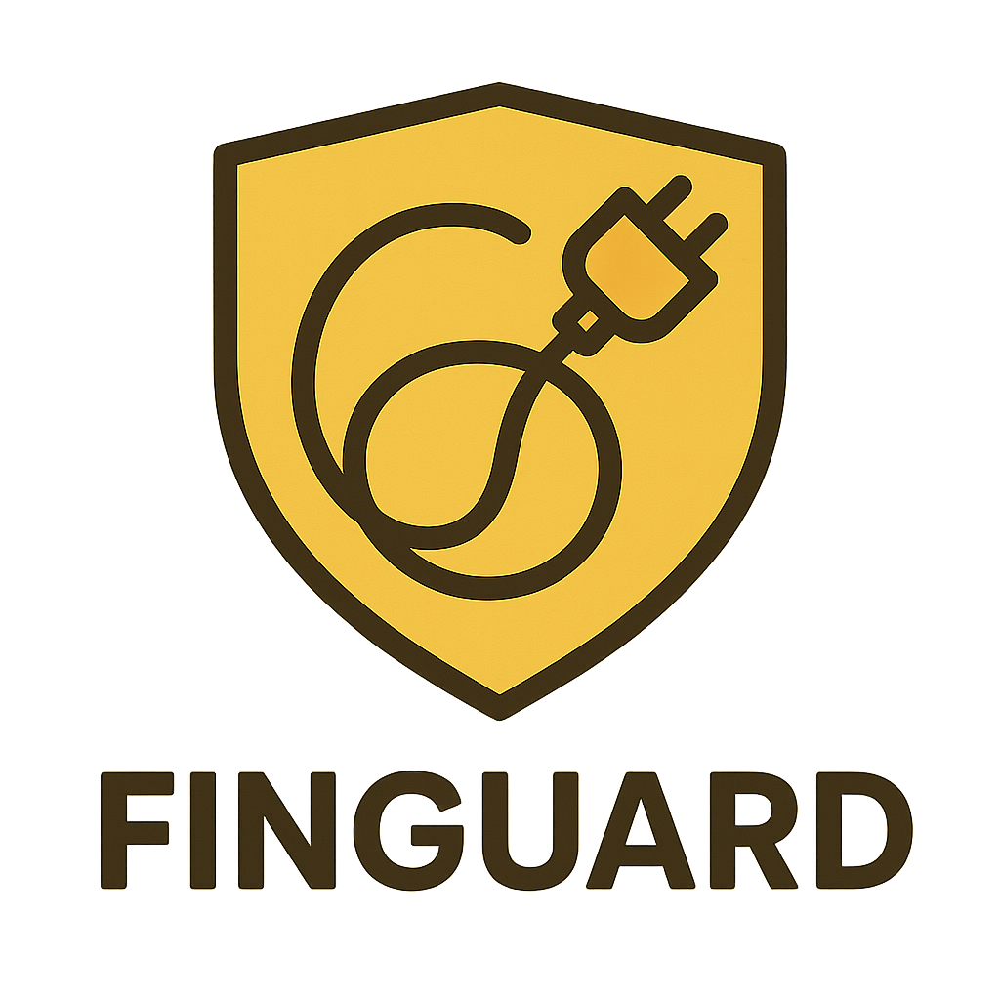

<div align="center">



**A high-performance userspace WireGuard proxy with web management and mDNS service discovery**

[](https://golang.org/)
[](LICENSE)
[](https://github.com/JPKribs/FinGuard)

[Features](#features) • [Quick Start](#quick-start) • [Web UI](#web-management-interface) • [Configuration](#configuration) • [Architecture](#architecture)

</div>

## Features

**Advanced HTTP Proxy**
- Subdomain-based routing (`jellyfin.local` → backend services)
- WebSocket support for real-time applications
- Connection pooling and health monitoring
- Enhanced error handling and logging

**Userspace WireGuard**
- Full WireGuard implementation without kernel modules
- Cross-platform TUN devices (macOS, Linux, Windows)
- Dynamic tunnel management via web interface
- Automatic route table updates
- Peer connection monitoring with reconnection logic

**Web Management Interface** 
- Modern dark theme with glassmorphism design
- Real-time service and tunnel management
- Mobile responsive design
- Live system monitoring and structured logs
- Token-based authentication

**mDNS Service Discovery**
- Automatic service advertising via Bonjour/Avahi
- TXT record metadata for service capabilities
- Zero-config networking between services
- Cross-platform discovery support

**Enterprise Features**
- Structured JSON logging with contextual data
- Health endpoints for Kubernetes integration
- Graceful shutdown and configuration reload
- Built-in metrics and monitoring

## Quick Start

### Prerequisites
- Go 1.24+ (for building from source)
- sudo privileges (for TUN device creation)
- WireGuard tools (optional, for key generation)

### Installation

```bash
# Clone the repository
git clone https://github.com/JPKribs/FinGuard.git
cd FinGuard

# Build the binary
make build

# Start with default configuration
sudo ./bin/finguard --config config.yaml
```

### First Run

1. Open the web interface: `http://localhost:10000`
2. Enter your admin token from `config.yaml`
3. Add services through the Services tab
4. Configure WireGuard tunnels through the Tunnels tab

## Configuration

### File Structure
```
FinGuard/
├── config.yaml          # Main server configuration
├── services.yaml        # HTTP service definitions (auto-generated)
├── wireguard.yaml       # WireGuard tunnel configs (auto-generated)
├── web/                 # Web management interface
│   ├── index.html
│   └── static/
└── utilities/           # Utility packages
```

### Main Configuration (`config.yaml`)
```yaml
server:
  http_addr: "0.0.0.0:10000"    # Management interface port
  proxy_addr: "0.0.0.0:80"      # Proxy server port
  admin_token: "your-secure-token-here"  # Change this!

log:
  level: "info"                 # debug, info, warn, error

services_file: "services.yaml"
wireguard_file: "wireguard.yaml"

discovery:
  enable: true
  mdns:
    enabled: true              # Enable mDNS/Bonjour
```

## Usage Examples

### Adding Services via Web Interface
Services can be added through the web interface at `http://localhost:10000`. Each service creates a subdomain route:

- `jellyfin.local` → `http://192.168.1.100:8096`
- `homeassistant.local` → `http://192.168.1.50:8123`
- Default service catches unmatched requests

### Adding Services via API
```bash
curl -X POST http://localhost:10000/api/v1/services \
  -H "Authorization: Bearer your-token" \
  -H "Content-Type: application/json" \
  -d '{
    "name": "myapp",
    "upstream": "http://192.168.1.100:8080",
    "websocket": true,
    "publish_mdns": true
  }'
```

### Creating WireGuard Tunnels
```bash
# Generate keys
wg genkey > private.key
wg pubkey < private.key > public.key

# Create tunnel via API
curl -X POST http://localhost:10000/api/v1/tunnels \
  -H "Authorization: Bearer your-token" \
  -H "Content-Type: application/json" \
  -d '{
    "name": "homelab",
    "private_key": "'$(cat private.key)'",
    "addresses": ["10.0.0.1/24"],
    "mtu": 1420,
    "peers": [{
      "name": "server",
      "public_key": "SERVER_PUBLIC_KEY",
      "endpoint": "vpn.example.com:51820",
      "allowed_ips": ["10.100.0.0/24"],
      "persistent_keepalive": 25
    }]
  }'
```

### Health Monitoring
```bash
# System health
curl http://localhost:10000/healthz
curl http://localhost:10000/readyz

# Detailed status
curl -H "Authorization: Bearer your-token" \
     http://localhost:10000/api/v1/status
```

## Build System

### Available Make Targets
```bash
make build          # Build the binary
make run            # Build and run with config.yaml
make test           # Run unit tests
make test-race      # Run tests with race detection
make clean          # Clean build artifacts
make fmt            # Format Go code
make vet            # Run go vet
make tidy           # Tidy go modules
make deps           # Download dependencies
make all            # Run fmt, vet, test, and build
```

### Manual Build
```bash
# Standard build
go build -o bin/finguard ./

# Or using the main package path if structured differently
go build -o bin/finguard .
```

## Architecture

### Core Components
- **Web Interface**: Management UI and REST API
- **HTTP Proxy**: Reverse proxy with subdomain routing
- **WireGuard Manager**: Tunnel lifecycle and monitoring
- **Config Manager**: File parsing, validation, hot reload
- **mDNS Discovery**: Service advertising and discovery

### Package Structure
```
├── main.go                  # Application entry point
├── api/v1/                 # REST API handlers
├── config/                 # Configuration management
├── proxy/                  # HTTP reverse proxy
├── wireguard/             # WireGuard tunnel management
├── discovery/             # mDNS service discovery
├── internal/              # Shared utilities (logging, health)
├── utilities/             # Common utilities (time, etc.)
└── web/                   # Static web assets
```

## Logging

FinGuard uses structured JSON logging with dual output:
- **Console**: JSON format for production use
- **Web Interface**: Formatted logs with context data via `/api/v1/logs`

Log entries include:
- Timestamp, level, message
- Structured context (method, host, status, duration, etc.)
- Pagination and filtering support
- In-memory storage (last 500 entries)

## Security Considerations

**Required Privileges**
- TUN device creation requires `CAP_NET_ADMIN` or sudo
- Port binding <1024 requires elevated privileges

**Best Practices**
- Change default admin token in `config.yaml`
- Use reverse proxy (nginx/caddy) for HTTPS termination
- Secure WireGuard private keys (`chmod 600`)
- Regular security updates

## Troubleshooting

**TUN Device Issues**
```bash
# Grant capabilities
sudo setcap cap_net_admin+ep ./bin/finguard

# Or run with sudo
sudo ./bin/finguard --config config.yaml
```

**Service Connectivity**
```bash
# Check service status
curl -H "Authorization: Bearer token" \
     http://localhost:10000/api/v1/services

# Test upstream directly
curl http://upstream-ip:port
```

**Debug Logging**
```bash
# Enable debug logs
echo 'log:\n  level: "debug"' >> config.yaml
./bin/finguard --config config.yaml
```

## Signal Handling

```bash
# Reload configuration (SIGHUP)
kill -HUP $(pgrep finguard)

# Graceful shutdown (SIGTERM/SIGINT)
kill -TERM $(pgrep finguard)
```

## License

MIT License - see [LICENSE](LICENSE) file for details.
